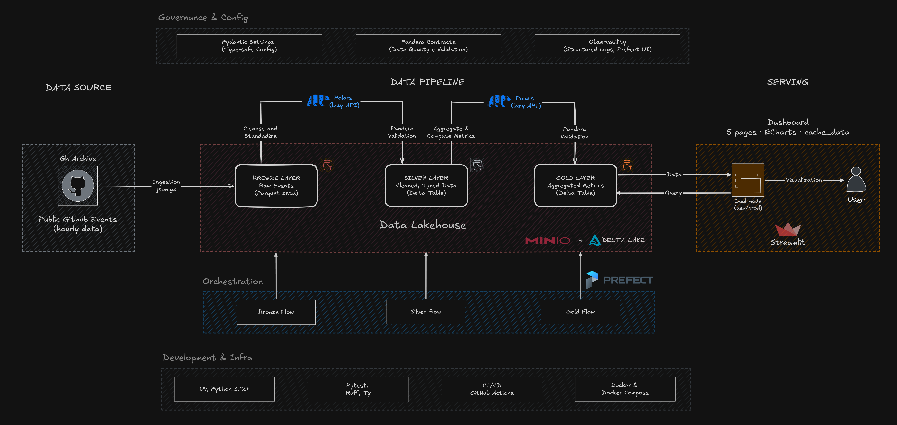

<div align="center">
  <h1>📊 GitPulse Analytics</h1>
  <p>
    <em>End-to-end data pipeline for GitHub analytics, from raw events to interactive dashboard.</em>
  </p>

  <p>
    <a href="https://gitpulse-analytics.streamlit.app/"></a>
    <a href="https://github.com/geogab-dev/gitpulse-analytics/actions/workflows/ci.yml"></a>
    
  </p>
</div>

---

## 🚀 Overview

Every day, millions of public GitHub events (pushes, PRs, issues, stars, forks) are generated, a goldmine of signals about developer productivity, community health, and ecosystem trends. But the raw data from [GH Archive](https://www.gharchive.org/) isn't query-ready.

**GitPulse Analytics** solves this with a Lakehouse pipeline (Bronze → Silver → Gold) that ingests, cleans, and aggregates this data into an interactive dashboard. The result? Visibility into **what the GitHub ecosystem is doing right now**: trending repos, community health, and code quality signals. All locally with open-source tools.

---

## 🎬 Demo

<p align="center">
  
  <br>
  <em>Dashboard pages: overview, community, code quality, and ecosystem.</em>
</p>

---

## 🏗️ Architecture

### Diagram

<p align="center">
  
  <br>
  <em>Data flows from GH Archive → Bronze (raw) → Silver (cleaned) → Gold (aggregated) → Dashboard.</em>
</p>

| Layer | Storage | Format | Description |
|-------|---------|--------|-------------|
| **Bronze** | MinIO `bronze` | Parquet (zstd) | Raw `.json.gz` → Parquet. Immutable, partitioned by `year/month/day/hour`. |
| **Silver** | MinIO `silver` | Delta Lake | Cleaned, typed, validated with Pandera. **1 fact** (events) + **3 dimensions** (actors, repos, orgs). UTC timestamps, same partition scheme. |
| **Gold** | MinIO `gold` | Delta Lake | `daily_activity` table at `(day, repo_id, org_id)` grain with **GitPulse Score** (0–100). Partitioned by `year/month`. |

### GitPulse Score

A daily score (0–100) that captures repository vitality from four weighted GitHub event types. The higher the number, the more active the project on that day

| Event | Weight | Rationale |
| ------- | -------- | ----------- |
| PushEvent | 1× | Baseline coding activity |
| WatchEvent (star) | 2× | Community interest |
| IssuesEvent | 3× | Bug tracking & discussion |
| PullRequestEvent | 5× | Collaboration & code review |

`score = min(push×1 + watch×2 + issues×3 + pr×5, 100)`

---

## 🏁 Quick Start

### Prerequisites

<table>
  <tr>
    <td><b>🐍 Python 3.12+</b></td>
    <td><a href="https://www.python.org/downloads/">python.org/downloads</a></td>
  </tr>
  <tr>
    <td><b>⚙️ make</b></td>
    <td>Built-in on macOS/Linux · <a href="https://learn.microsoft.com/en-us/windows/wsl/setup/environment">Windows (WSL)</a></td>
  </tr>
  <tr>
    <td><b>🐳 Docker & Compose</b></td>
    <td><a href="https://docs.docker.com/get-docker/">docs.docker.com/get-docker</a></td>
  </tr>
  <tr>
    <td><b>📦 uv</b></td>
    <td><a href="https://docs.astral.sh/uv/#getting-started">docs.astral.sh/uv</a> <br> <code>pip install uv</code> or <code>curl -LsSf https://astral.sh/uv/install.sh | sh</code></td>
  </tr>
</table>

### 1. Clone & install

```bash
git clone https://github.com/geogab-dev/gitpulse-analytics.git
cd gitpulse-analytics
make install         # uv sync creates .venv with all dependencies
```

### 2. Start infra & run pipeline

```bash
make up              # MinIO, PostgreSQL, Prefect server
make pipeline        # Full pipeline: bronze → silver → gold (last 7 days)
```

> ⚡ The full pipeline processes 7 days of data (~30M events) in **~5 minutes** using 10 thread-pool workers and 12 GB RAM.

### 3. Launch dashboard

```bash
make dashboard       # http://localhost:8501
```

> 💡 For all available make commands run `make help`

---

## ✨ Dashboard Features

| Page | Highlights |
|----------|------------|
| **📈 Overview** | KPI cards (events, repos, contributors, score), daily timeline, event type distribution, top repos, stacked events |
| **👥 Community** | Bot vs. human breakdown, top contributors, contributor growth, activity heatmap × hour |
| **💻 Code Quality** | PR merge rate, PR funnel, issue close rate, review metrics (reviews & comments per PR), Score timeline |
| **📈 Ecosystem** | Org summary, trending repos, star & fork growth, stars vs. engagement analysis |

---

## 🛠️ Tech Stack

| Category | Technology | Purpose |
|----------|-----------|---------|
| **Storage** | [MinIO](https://min.io/) + [Delta Lake](https://delta.io/) | S3-compatible storage, ACID transactions, time travel, schema enforcement |
| **Format** | [Apache Parquet](https://parquet.apache.org/) (zstd) | Columnar storage with high compression |
| **ETL** | [Polars](https://pola.rs/) | Lazy DataFrame API, streaming, zero pandas |
| **Validation** | [Pandera](https://pandera.readthedocs.io/) | Runtime data contracts, fast-fail on quality issues |
| **Orchestration** | [Prefect v3](https://docs.prefect.io/v3/) | Retries, monitoring, idempotent flows |
| **Visualization** | [Streamlit](https://streamlit.io/) + [ECharts](https://echarts.apache.org/) | Interactive dashboard with rich chart types |
| **Config** | [Pydantic Settings](https://docs.pydantic.dev/latest/concepts/pydantic_settings/) | Typed, validated environment variables |
| **Infra** | [Docker Compose](https://docs.docker.com/compose/) | Local MinIO, PostgreSQL, Prefect server |
| **Deps** | [uv](https://docs.astral.sh/uv/) | Fast Python package manager |

---

## 📄 Data Source

All data comes from the **[GH Archive](https://www.gharchive.org/)**, a public dataset recording every public GitHub event since February 2015, released as hourly `.json.gz` files.

**Bronze (raw):** all event types are ingested with no filtering, every GH Archive event lands in the lake.

**Silver (cleaned):** 12 event types with analytical value are kept. 4 low-value types are explicitly excluded:

| Excluded type | Reason |
|---------------|--------|
| `GollumEvent` | Wiki page changes, no analytical signal |
| `MemberEvent` | Internal membership management |
| `DiscussionEvent` | Discussions (low adoption in GH Archive) |
| `PublicEvent` | Repo visibility toggle (one-time event) |

**Tracked event types:**

`PushEvent` · `PullRequestEvent` · `IssuesEvent` · `WatchEvent` · `IssueCommentEvent` · `PullRequestReviewEvent` · `PullRequestReviewCommentEvent` · `CreateEvent` · `DeleteEvent` · `ForkEvent` · `ReleaseEvent` · `CommitCommentEvent`

---

## 📁 Project Structure

```text
gitpulse-analytics/
├── src/core/              # Business logic (orchestrator-agnostic)
│   ├── config/            # Pydantic Settings
│   ├── contracts/         # Pandera schemas
│   ├── ingestion/         # GH Archive → Bronze
│   ├── transforms/        # Bronze → Silver, Silver → Gold
│   └── helpers/           # S3, Delta, logging
├── pipelines/             # Prefect flows (thin orchestration)
├── dashboard/             # Streamlit app
├── tests/                 # Pytest suite
├── infra/                 # Init scripts
├── docs/                  # Architecture diagram
├── docker-compose.yaml
├── Makefile
├── pyproject.toml
└── .python-version
```

---

## 🧪 Engineering Highlights

| Aspect | Implementation | Benefit |
|--------|---------------|---------|
| **Data contracts** | Pandera schemas validate every write at Silver and Gold layers | Corrupted data is rejected immediately, never silently ingested, downstream consumers always get consistent, reliable data |
| **Idempotent pipelines** | Partition-aware overwrite mode, skip-if-exists checks | Safe to re-run any flow without duplicates or data loss |
| **Clean architecture** | Business logic isolated in `src/core/`, pipelines are thin orchestrators | Swap orchestration (Prefect, Airflow, Dagster) without touching transforms |
| **Reproducible infra** | Docker Compose for MinIO + PostgreSQL + Prefect, `uv` for deterministic deps | New contributors run the full stack with 2 commands |
| **Observability** | Structured logging at every stage, Prefect retries (3×, 30s delay), error UI in dashboard | Failures are traceable and recoverable without manual intervention |
| **Typed configuration** | Pydantic Settings validates all environment variables at startup | Misconfiguration is caught before pipeline execution, not during |

---

## 🤝 Contributing

Contributions are welcome! Feel free to open an [issue](https://github.com/geogab-dev/gitpulse-analytics/issues) or submit a PR.

---

<div align="center">
  <sub>Built with ❤️ using Python, Polars, Delta Lake, Streamlit, and Prefect.</sub>
  <br>
</div>
